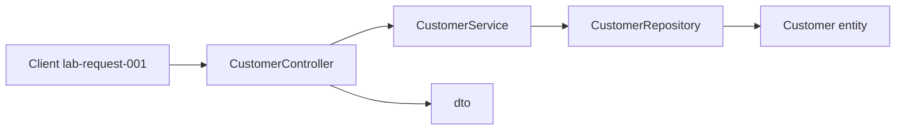

# Layer flow — create Amina Khan (`CUS-1001`)

Correlation ID: `lab-request-001`

## Each hop

1. **Client** sends the create request (correlation ID `lab-request-001`). The payload
   carries `fullName` and `email` only — the client does not choose the customer ID and
   does not set the status.

2. **`CustomerController`** accepts a `CustomerRequest`. Presentation owns *transport
   only*: take the payload, check its shape (name present, email well-formed), delegate
   to the service, return whatever comes back. No business rules, no SQL, no entity — the
   controller never sees a `Customer`.

3. **`CustomerService`** applies the business rules:
   - assigns a unique customer ID — `CUS-1001`
   - defaults status to `ACTIVE` when the request does not carry one
   - rejects a blank `fullName` before anything is stored

   The service also maps `CustomerRequest` → `Customer` and `Customer` →
   `CustomerResponse`. It is the only layer holding both shapes, which is why the
   conversion lives here.

4. **`CustomerRepository`** stores the `Customer` entity.
   - **NOW (Lab 8):** stub — throws `UnsupportedOperationException`
   - **Next labs:** in-memory `List<Customer>`
   - **LATER:** Spring Data JPA over PostgreSQL

   The repository only ever sees the entity. A DTO reaching this layer would make the
   API contract the database schema.

5. **Response DTO** returns `CUS-1001` / `ACTIVE`. What must **not** leak:
   - the `Customer` entity itself — the client gets a `CustomerResponse`
   - `email` — it comes in on the request and never goes back out
   - stack traces, SQL, or any persistence detail
   - anything the client did not ask for

   Out of the whole entity, only `customerId`, `fullName`, `status` and `createdAt`
   cross the boundary.

## Failure path

A blank `fullName` fails validation in **`CustomerService`**, so the request dies there
and `CustomerRepository` is never called — nothing reaches storage and there is no
partial write to clean up. A lookup that finds nothing throws
`CustomerNotFoundException`, which a global handler maps to a 404 once HTTP exists.

The layer that stops the request is the layer that owns the rule.

## Types in flight

| Hop | Type |
| --- | ---- |
| client → controller | JSON |
| controller → service | `CustomerRequest` — fullName, email |
| service → repository | `Customer` — customerId, fullName, email, status, createdAt |
| repository → service | `Customer` |
| service → controller | `CustomerResponse` — customerId, fullName, status, createdAt |
| controller → client | JSON |

Entities never leave the service. DTOs never reach storage.

## NOW vs FUTURE

- **NOW (Lab 8):** skeleton + stubs only
- **FUTURE:** Angular SPA, Kafka, PostgreSQL / Spring Boot — out of scope for Lab 8

## Optional Mermaid

