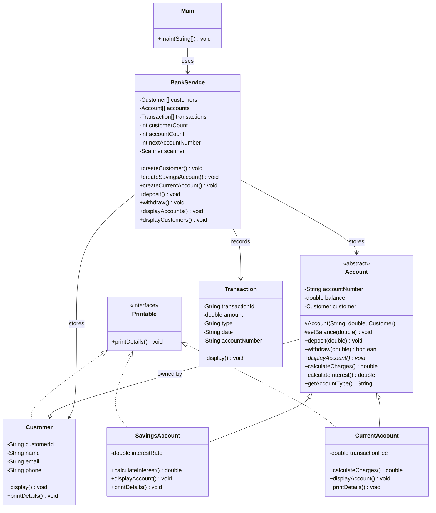

# Lab 3 - Short answers

## Step 14 - UML class diagram

## Step 13 - SOLID checklist

**SRP** - Three layers. Customer/Account/SavingsAccount/CurrentAccount/Transaction hold
data and their own behavior; BankService owns the arrays, the Scanner and the prompts;
Main owns only the menu loop and the switch. No model class reads input and no model class
except through its own display method prints.

**OCP** - Adding an account product means writing one subclass. BankService.withdraw()
calls account.calculateCharges() on the Account reference, so a new type with its own fee
rule works without editing withdraw(). Nothing in the service switches on account type.

**LSP** - accounts[] is an Account[] holding both concrete types. Every menu path treats
them identically - deposit, withdraw and displayAccounts never cast and never test the
type - so either subtype is usable anywhere Account is expected.

**ISP** - Printable declares one method, printDetails(). Customer implements it over its
own fields; the two account types delegate it to displayAccount(). No implementer is
forced to supply a method it has no use for.

**DIP** - Main depends on the BankService API, not on the arrays or counters behind it.
The customers/accounts/transactions arrays and every counter are private, so the menu
cannot reach past the service into storage.

## Reflection questions

**1. Why should Account be abstract rather than a concrete empty type?**

A bare Account is not a product the bank sells - there is no such thing as an account that
is neither savings nor current, and it has no sensible displayAccount() output. Making it
abstract turns that into a compile error instead of a runtime surprise: writing
new Account("X", 0, null) fails with "Account is abstract; cannot be instantiated"
(captured in screenshots/lab-3/step-11-abstract-proof.txt). The shared deposit/withdraw
logic still lives in one place; only the parts that differ are left for subclasses.

**2. Where does dynamic dispatch show up when you call displayAccount() on Account[]?**

displayAccounts() loops the array with a variable of static type Account and calls
accounts[i].displayAccount(). The compiler only knows the declared type, so the choice of
SavingsAccount's override or CurrentAccount's is made at runtime from the object's actual
class. The same happens for calculateCharges() in withdraw(): savings returns the base
0.0 and current returns its fee, which is why the fee lines print for one type and not the
other without any cast or instanceof.

**3. How does Printable differ from extending a base class?**

Printable is a contract with no state and no implementation, and a class can implement any
number of interfaces while it can only extend one class. SavingsAccount already spends its
single inheritance slot on Account, so printability had to come from an interface -
Customer implements the same contract without sharing any ancestor with the accounts.
Extending a base class inherits fields and working methods; implementing an interface only
promises a method exists.
